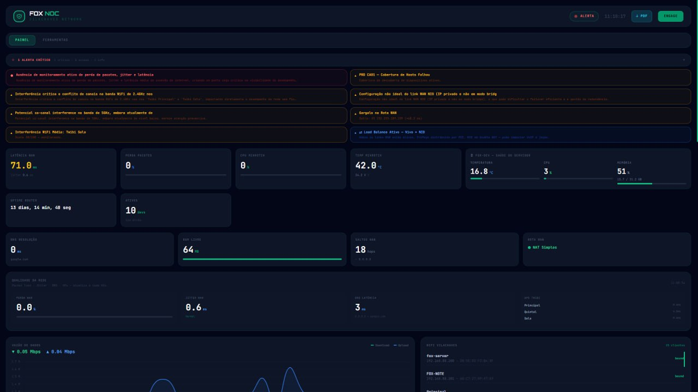
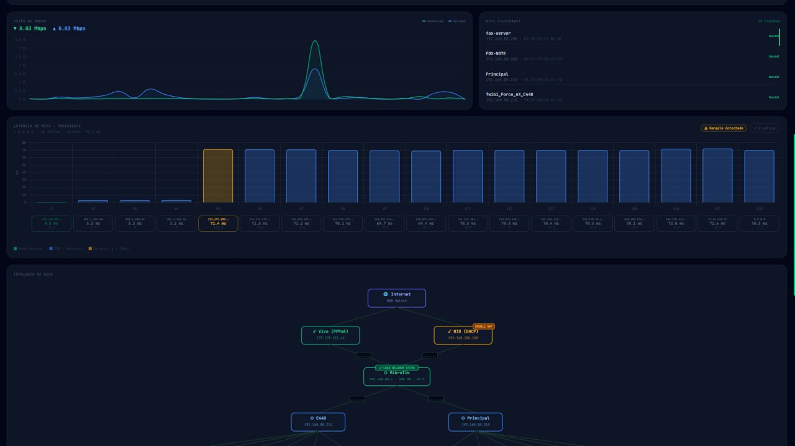
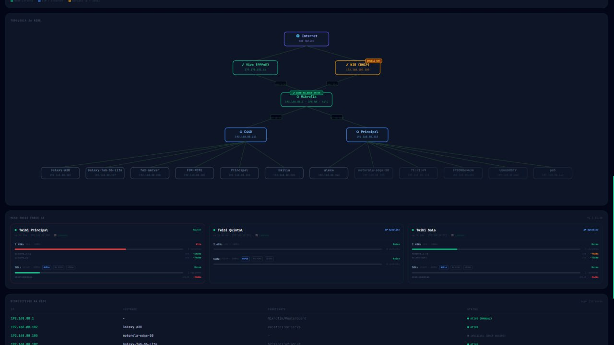
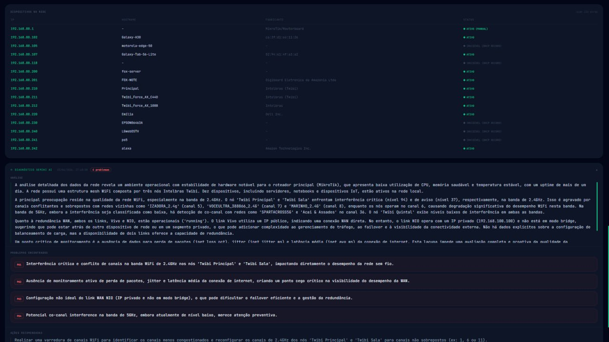
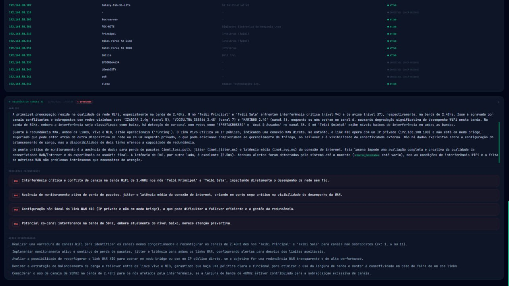

# Home Net Monitor

> Continuous network monitoring with intelligent diagnostics — real-time alerts, root cause correlation, and actionable recommendations. 100% offline, no cloud required.



[](https://www.python.org/)
[](https://fastapi.tiangolo.com/)
[](https://www.sqlite.org/)
[](https://www.docker.com/)
[](LICENSE)

**Running in production as a systemd service on a home server since March 2026.**

---

## What It Does

Most network monitoring tools give you graphs. This one gives you **diagnoses**.

Home Net Monitor runs continuously in the background, collecting metrics from multiple sources simultaneously. A correlation engine cross-references those metrics against 10 diagnostic rules and tells you not just *what* is wrong, but *why* — with specific RouterOS commands to fix it.

### Collectors (run in parallel as async tasks)

| Collector | What it measures |
|---|---|
| **ICMP** | Latency, jitter, packet loss to gateway, internal DNS, external DNS, internet |
| **DNS** | Response times from internal and external resolvers |
| **SNMP (MikroTik)** | CPU load, WAN traffic, channel utilization, noise floor, retry rate |
| **Wi-Fi** | Local wireless interface signal and quality |
| **Fingerprint** | ARP scan + MAC OUI vendor lookup + mDNS hostname + device classification |

Each collector is an independent `asyncio.Task` — one failure never brings down the others.

---

## Correlation Engine — Diagnostics Table

| Detected symptom | Diagnosis |
|---|---|
| Gateway OK + slow internet | ISP-side problem |
| Gateway slow over Wi-Fi | Radio interference or saturation |
| Internal DNS slow + external fast | Router overloaded |
| MikroTik CPU > 80% for > 60s | NAT/Firewall saturated |
| Channel utilization > 70% | Wi-Fi congested |
| Retry rate > 15% | RF interference |
| Latency delta under load > 30ms | Bufferbloat |
| Gateway unreachable > 30s | Connection down |
| Noise floor > −75 dBm | Excessive RF noise |
| WAN IP changed unexpectedly | ISP failover or modem reset |

---

## Screenshots









---

## Tech Stack

| Layer | Technology |
|---|---|
| Backend | Python 3.11+, FastAPI, AsyncIO |
| Real-time updates | Server-Sent Events (SSE) — no polling |
| Frontend | Tailwind CSS, Chart.js |
| Storage | SQLite (WAL mode) — persistent history |
| Network scanning | Scapy (ARP), pysnmp (SNMP v2c), zeroconf (mDNS) |
| Deploy | systemd service, Docker |

---

## Architecture

```
collectors/
  icmp.py         — async ICMP probes (no root required — uses cap_net_raw)
  dns.py          — DNS resolver timing
  snmp.py         — MikroTik SNMP v2c
  wifi.py         — local Wi-Fi interface metrics
  fingerprint.py  — ARP + OUI + mDNS device discovery

engine/
  correlator.py   — 10 diagnostic rules, cross-source correlation
  recommender.py  — maps diagnoses to specific fix commands (RouterOS)

api/              — FastAPI REST endpoints + SSE stream
db/               — async SQLite repository (WAL mode)
frontend/         — dashboard HTML/CSS/JS (Tailwind + Chart.js)
tests/            — pytest, target ≥ 80% coverage
```

---

## Quick Start

### As a systemd service (recommended for production)

```bash
git clone https://github.com/JConradoN/home-net-monitor.git
cd home-net-monitor
cp config.example.json config.json
# Edit config.json: set your router IP and SNMP community
sudo bash install.sh
```

`install.sh` creates the virtualenv, installs dependencies, grants `cap_net_raw` for ICMP without root, and enables the service. Dashboard available at `http://localhost:8080`.

### Manual / development

```bash
python -m venv .venv && source .venv/bin/activate
pip install -r requirements.txt
python main.py --debug
# With MikroTik SNMP:
python main.py --snmp-host 192.168.1.1
```

### Docker

```bash
docker build -t home-net-monitor .
docker run --network host home-net-monitor
```

---

## Configuration

```json
{
  "host": "0.0.0.0",
  "port": 8080,
  "snmp_host": "192.168.1.1",
  "snmp_community": "public",
  "icmp_interval": 30,
  "dns_interval": 60,
  "snmp_interval": 60,
  "fingerprint_interval": 300,
  "thresholds": {
    "gw_latency_high": 50,
    "internet_latency_high": 150,
    "dns_slow": 100,
    "cpu_critical": 80,
    "channel_util": 70,
    "retries": 15
  }
}
```

---

## REST API

Full interactive docs at `/api/docs` (Swagger UI).

| Endpoint | Description |
|---|---|
| `GET /api/status` | Overall status: ok / warning / critical |
| `GET /api/alerts` | Active alerts with severity and message |
| `GET /api/metrics/icmp` | Latest latency and packet loss |
| `GET /api/metrics/dns` | Latest DNS response times |
| `GET /api/metrics/snmp` | CPU, traffic, Wi-Fi via MikroTik |
| `GET /api/devices` | Discovered devices with fingerprint |
| `GET /api/history/outages` | Outage history (7 days) |
| `GET /api/history/latency` | Latency time series (24h) |
| `GET /api/recommendations` | Active recommendations with RouterOS steps |
| `GET /api/events` | SSE stream — real-time push updates |

---

## Tests

```bash
pytest tests/ -v --cov=. --cov-report=term-missing
```

---

## Part of the FOX Network Intelligence Suite

This tool is designed to work alongside **[Network Diagnoser AI](https://github.com/JConradoN/network-diagnoser-ai)** as a complementary pair:

| Tool | Role | When to use |
|---|---|---|
| **Home Net Monitor** (this) | Passive 24/7 daemon — detects and alerts | Always running in the background |
| **[Network Diagnoser AI](https://github.com/JConradoN/network-diagnoser-ai)** | Active on-demand scanner — deep diagnosis | When an alert fires and you need to investigate |

**Typical workflow:**
1. Home Net Monitor fires a "gateway latency spike" alert
2. You trigger Network Diagnoser AI to run a full scan
3. Diagnoser performs ARP sweep, SNMP deep-dive, mDNS/SSDP discovery, and sends structured data to an LLM
4. You get a root cause analysis and specific fix steps in plain English

---

## Background

Built by a network engineer with 30 years of infrastructure experience. The diagnostic rules in the correlation engine come from real-world troubleshooting patterns — the same mental model an experienced engineer uses when diagnosing a network complaint, encoded as software.

Compatible with any Linux host. Optimized for home and small office networks with MikroTik routers.

---

## License

[MIT](LICENSE) — Copyright (c) 2026 João Conrado
